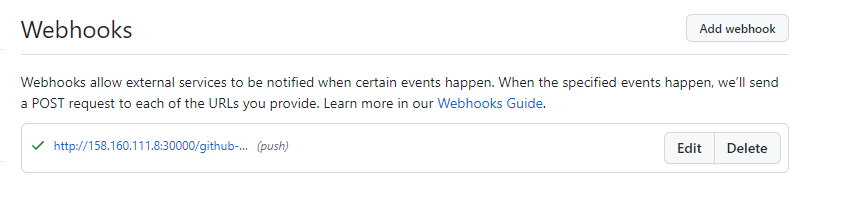
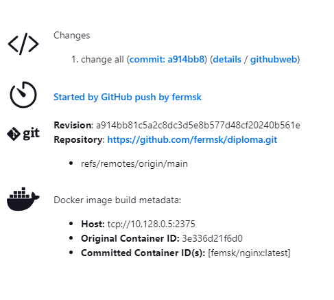

# Дипломный практикум в Yandex.Cloud
## Цели:
### Этапы выполнения:
* Создание облачной инфраструктуры
* Создание Kubernetes кластера
* Создание тестового приложения
* Подготовка cистемы мониторинга и деплой приложения
* Установка и настройка CI/CD

## Репозиторий для выполнения дипломного практикума - [Git repo](https://github.com/fermsk/diploma)

## Этапы выполнения:
## 1. Создание облачной инфраструктуры
* Директория ./terraform-deprecated
#### 1.1 Сборка terraform-provider-yandex:
```
git clone https://github.com/yandex-cloud/terraform-provider-yandex.git
make build
```
#### 1.2 Используйте один workspace, назвав его stage
```
femsk@ubuntu-test-vm:~/diploma/diploma/terraform-deprecated$ terraform workspace new stage
Created and switched to workspace "stage"!
```
#### 1.3 Конфигурация создана ./main.tf, успешно прошёл проверку:
```
femsk@ubuntu-test-vm:~/diploma/diploma/terraform-deprecated$ terraform validate
Success! The configuration is valid.
```
#### 1.4 Добавление переменных окружения
```
export YC_TOKEN=$(yc iam create-token)
export YC_CLOUD_ID=$(yc config get cloud-id)
export YC_FOLDER_ID=$(yc config get folder-id)
```
#### 1.5 Команда terraform plan выводит список ресурсов с их параметрами:
```
femsk@ubuntu-test-vm:~/diploma/diploma/terraform-deprecated$ terraform plan
Terraform used the selected providers to generate the following execution plan. Resource actions are indicated with the following symbols:
+ create
...
```
#### 1.6 Команда terraform apply создаёт ресурсы (3 ВМ сеть и 3 подсети):
```
femsk@ubuntu-test-vm:~/diploma/diploma/terraform-deprecated$ terraform apply
...
Apply complete! Resources: 7 added, 0 changed, 0 destroyed.
```
#### 1.7 Команда terraform destroy удаляет все созданные ресурсы описанные в  backend для Terraform (./main.tf):
```
femsk@ubuntu-test-vm:~/diploma/diploma/terraform-deprecated$ terraform destroy
...
Destroy complete! Resources: 7 destroyed.
``` 
### Доработка 
#### 1.8 Для генерации файла инвентаризации ansible используется утилита terraform-inventory. Команда ansible-playbook: 
```
ansible-playbook --inventory-file=./terraform-inventory
```
_________
## 2. Создание Kubernetes кластера
* Директория - ./kube
* Подготовка 3-x ВМ для создания кластера - terraform apply
* Установка зависимостей:
```
femsk@ubuntu-test-vm:~/diploma/diploma/terraform-deprecated$ ansible-playbook --inventory-file=./terraform-inventory ../kube/depend.yml
```
#### 2.1 Настройка мастер ноды:
```
femsk@ubuntu-test-vm:~/diploma/diploma/terraform-deprecated$ ansible-playbook --inventory-file=./terraform-inventory ../kube/master.yml
```
Открывается ssh-сессия на мастер-ноду, и проверяется состояние главного узла кластера:
```
femsk@ubuntu-test-vm:~/diploma/diploma/kube$ ssh femsk@$master
Welcome to Ubuntu 20.04.6 LTS (GNU/Linux 5.4.0-162-generic x86_64)
femsk@master-node:~$ kubectl get nodes
NAME          STATUS   ROLES           AGE     VERSION
master-node   Ready    control-plane   4m57s   v1.28.1
```
#### 2.2 Добавление воркеров в кластер:
```
femsk@ubuntu-test-vm:~/diploma/diploma/terraform-deprecated$ ansible-playbook --inventory-file=./terraform-inventory ../kube/workers.yml
```
Открывается ssh-сессия на мастер-ноду, и проверяется состояние кластера:
```
femsk@ubuntu-test-vm:~/diploma/diploma/kube$ ssh femsk@$master
Welcome to Ubuntu 20.04.6 LTS (GNU/Linux 5.4.0-162-generic x86_64)
femsk@master-node:~$ kubectl get nodes
NAME          STATUS   ROLES           AGE   VERSION
master-node   Ready    control-plane   11m   v1.28.1
work-node1    Ready    <none>          26s   v1.28.1
work-node2    Ready    <none>          26s   v1.28.1
```
#### 2.3 Команда kubectl get pods --all-namespaces отрабатывает без ошибок:
```    
femsk@master-node:~$ kubectl get pods --all-namespaces
NAMESPACE      NAME                                  READY   STATUS    RESTARTS   AGE
kube-flannel   kube-flannel-ds-pdsfw                 1/1     Running   0          3m9s
kube-flannel   kube-flannel-ds-svz8s                 1/1     Running   0          13m
kube-flannel   kube-flannel-ds-ws5bm                 1/1     Running   0          3m9s
kube-system    coredns-5dd5756b68-6s65z              1/1     Running   0          13m
kube-system    coredns-5dd5756b68-vp2pm              1/1     Running   0          13m
kube-system    etcd-master-node                      1/1     Running   0          13m
kube-system    kube-apiserver-master-node            1/1     Running   0          13m
kube-system    kube-controller-manager-master-node   1/1     Running   0          13m
kube-system    kube-proxy-2rcrs                      1/1     Running   0          13m
kube-system    kube-proxy-g6qz7                      1/1     Running   0          3m9s
kube-system    kube-proxy-p4wsf                      1/1     Running   0          3m9s
kube-system    kube-scheduler-master-node            1/1     Running   0          13m
femsk@master-node:~$
```
_________
## 3. Создание тестового приложения и деплой приложения
* Директория ./app
* Приложение создано из базового образа nginx:1.24.0, доработан автоматический запуск nginx, Dockerfile:
```  
FROM nginx:1.24.0
CMD ["nginx" "-g" "daemon off;"]
```
* Сборка Docker образа: 
```
docker build -t nginxdip . 
```
* Назначается tag Docker образу: 
``` 
docker tag nginxdip femsk/nginx:1.0
```
* Docker образ пушится: 
```
docker push femsk/nginx:1.0
```
* Образ nginx - femsk/nginx:1.0
* Деплой приложения в кластер производится в Jenkins.
_________
## 4. Подготовка cистемы мониторинга  
* Директория ./monitor 
* Добавлен сабмодуль https://github.com/prometheus-operator/kube-prometheus.git, директория ./kube-prometheus
* Деплой: 
```
femsk@ubuntu-test-vm:~/diploma/diploma/terraform-deprecated$ ansible-playbook --inventory-file=./terraform-inventory ../monitor/deploy.yml
```
* Http доступ к web интерфейсу grafana - [Grafana](http://158.160.111.8:30271) (admin admin)
 

_________
## 5. Установка и настройка CI/CD 
* Директория ./cicd
* Деплой Jenkins в кластер - 
``` 
femsk@ubuntu-test-vm:~/diploma/diploma/terraform-deprecated$ ansible-playbook --inventory-file=./terraform-inventory ../cicd/deploy_j.yml
``` 
* Интерфейс ci/cd сервиса доступен по http - [Jenkins](http://158.160.111.8:30000) (diploma 1Qazxcvb)
* Сервис типа **NodePort** для доступа "снаружи" - [Jenkins Service](https://github.com/fermsk/diploma/blob/main/cicd/jenk.yml#L31)
* Настройка Cloud Docker в jenkins, изменения в настройки докера в systemd на master-node:
```
#ExecStart=/usr/bin/dockerd -H fd:// --containerd=/run/containerd/containerd.sock
ExecStart=/usr/bin/dockerd -H tcp://0.0.0.0:2375 -H unix:///var/run/docker.sock -H fd:// --containerd=/run/containerd/containerd.sock
```
* Настройка Jenkins job - [Jenkins job](http://158.160.111.8:30000/job/diploma1/configure)
* Настройка  GitHub Webhooks 

* При любом коммите или создании тэга в репозиторий с тестовым приложением происходит сборка и отправка в регистр Docker образа,
и деплой приложения.

* Сервис типа **NodePort** для доступа "снаружи" - https://github.com/fermsk/diploma/blob/main/app/nginx.yml#L20
* Сервис приложения доступен по адресу - [Nginx app](http://158.160.111.8:30001/)
_________


    


