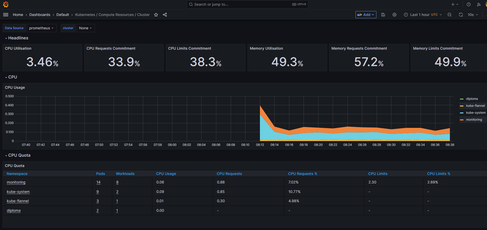
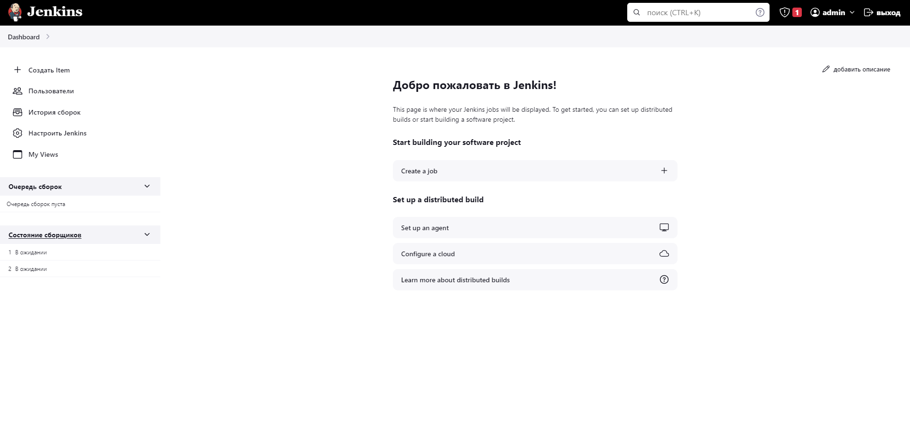
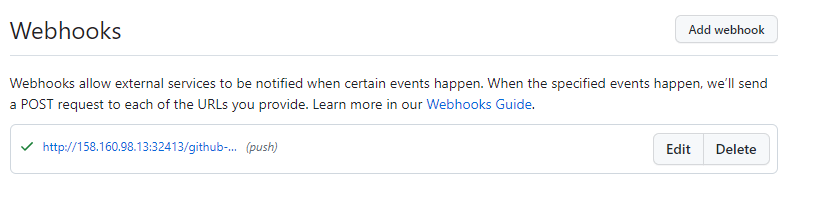
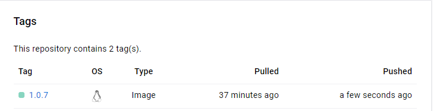

# Дипломный практикум в Yandex.Cloud
## Цели:
### Этапы выполнения:
* Создание облачной инфраструктуры
* Создание Kubernetes кластера
* Создание тестового приложения
* Подготовка cистемы мониторинга и деплой приложения
* Установка и настройка CI/CD

## Этапы выполнения:
## 1. Создание облачной инфраструктуры
* Директория ./terraform-deprecated
#### 1.1 Сборка terraform-provider-yandex:
    git clone https://github.com/yandex-cloud/terraform-provider-yandex.git
    make build
#### 1.2 Используйте один workspace, назвав его stage

    femsk@ubuntu-test-vm:~/diploma/diploma/terraform-deprecated$ terraform workspace new stage
    Created and switched to workspace "stage"!

#### 1.3 Конфигурация создана ./main.tf, успешно прошёл проверку:

    femsk@ubuntu-test-vm:~/diploma/diploma/terraform-deprecated$ terraform validate
    Success! The configuration is valid.
#### 1.4 Добавление переменных окружения

    export YC_TOKEN=$(yc iam create-token)
    export YC_CLOUD_ID=$(yc config get cloud-id)
    export YC_FOLDER_ID=$(yc config get folder-id)
#### 1.5 Команда terraform plan выводит список ресурсов с их параметрами:

    femsk@ubuntu-test-vm:~/diploma/diploma/terraform-deprecated$ terraform plan
    
    Terraform used the selected providers to generate the following execution plan. Resource actions are indicated with the following symbols:
    + create
    ...
#### 1.6 Команда terraform apply создаёт ресурсы (3 ВМ сеть и подсеть):

    femsk@ubuntu-test-vm:~/diploma/diploma/terraform-deprecated$ terraform apply
    ...
    Apply complete! Resources: 5 added, 0 changed, 0 destroyed.
#### 1.7 Команда terraform destroy удаляет все созданные ресурсы описанные в  backend для Terraform (./main.tf):

    femsk@ubuntu-test-vm:~/diploma/diploma/terraform-deprecated$ terraform destroy
    ...
    Destroy complete! Resources: 5 destroyed.
_________
## 2. Создание Kubernetes кластера
* Директория - ./kube
* Подготовка 3-x ВМ для создания кластера - terraform apply
* Установка зависимостей - ansible-playbook -i hosts depend.yml

#### 2.1 Настройка мастер ноды:
    femsk@ubuntu-test-vm:~/diploma/diploma/kube$ ansible-playbook -i hosts master.yml
Открывается ssh-сессия на мастер-ноду, и проверяется состояние главного узла кластера:

    femsk@ubuntu-test-vm:~/diploma/diploma/kube$ ssh femsk@$master
    Welcome to Ubuntu 20.04.6 LTS (GNU/Linux 5.4.0-162-generic x86_64)
    
    femsk@master-node:~$ kubectl get nodes
    NAME          STATUS   ROLES           AGE     VERSION
    master-node   Ready    control-plane   4m57s   v1.28.1

#### 2.2 Добавление воркеров в кластер:
    femsk@ubuntu-test-vm:~/diploma/diploma/kube$ ansible-playbook -i hosts workers.yml
Открывается ssh-сессия на мастер-ноду, и проверяется состояние кластера:

    femsk@ubuntu-test-vm:~/diploma/diploma/kube$ ssh femsk@$master
    Welcome to Ubuntu 20.04.6 LTS (GNU/Linux 5.4.0-162-generic x86_64)
    
    femsk@master-node:~$ kubectl get nodes
    NAME          STATUS   ROLES           AGE   VERSION
    master-node   Ready    control-plane   11m   v1.28.1
    work-node1    Ready    <none>          26s   v1.28.1
    work-node2    Ready    <none>          26s   v1.28.1
#### 2.3 Команда kubectl get pods --all-namespaces отрабатывает без ошибок:
    femsk@master-node:~$ kubectl get pods --all-namespaces
    NAMESPACE      NAME                                  READY   STATUS    RESTARTS   AGE
    kube-flannel   kube-flannel-ds-pdsfw                 1/1     Running   0          3m9s
    kube-flannel   kube-flannel-ds-svz8s                 1/1     Running   0          13m
    kube-flannel   kube-flannel-ds-ws5bm                 1/1     Running   0          3m9s
    kube-system    coredns-5dd5756b68-6s65z              1/1     Running   0          13m
    kube-system    coredns-5dd5756b68-vp2pm              1/1     Running   0          13m
    kube-system    etcd-master-node                      1/1     Running   0          13m
    kube-system    kube-apiserver-master-node            1/1     Running   0          13m
    kube-system    kube-controller-manager-master-node   1/1     Running   0          13m
    kube-system    kube-proxy-2rcrs                      1/1     Running   0          13m
    kube-system    kube-proxy-g6qz7                      1/1     Running   0          3m9s
    kube-system    kube-proxy-p4wsf                      1/1     Running   0          3m9s
    kube-system    kube-scheduler-master-node            1/1     Running   0          13m
    femsk@master-node:~$
_________
## 3. Создание тестового приложения и деплой приложения
* Директория ./app
* Приложение создано из базового образа nginx:1.24.0, доработан автоматический запуск nginx, Dockerfile:
  
        FROM nginx:1.24.0
        CMD ["nginx" "-g" "daemon off;"]
* Сборка Docker образа: 

        docker build -t nginxdip . 

* Назначается tag Docker образу: 
 
        docker tag nginxdip femsk/nginx:1.0

* Docker образ пушится: 

         docker push femsk/nginx:1.0

* Образ nginx - femsk/nginx:1.0
* Деплой приложение в кластер:

        femsk@ubuntu-test-vm:~/diploma/diploma/app$ ansible-playbook -i ../kube/hosts deploy.yml
      
        PLAY [master] ******************************************************************************************************************************************************************************
      
        TASK [Copying yaml] ************************************************************************************************************************************************************************
        changed: [master]
      
        TASK [Deployment] **************************************************************************************************************************************************************************
        changed: [master]
      
        PLAY RECAP *********************************************************************************************************************************************************************************
        master                     : ok=2    changed=2    unreachable=0    failed=0    skipped=0    rescued=0    ignored=0
        

        femsk@master-node:~$ kubectl get pods -n diploma -owide
        NAME                  READY   STATUS    RESTARTS   AGE   IP           NODE         NOMINATED NODE   READINESS GATES
        ng-75967b7d86-p4qkj   1/1     Running   0          65m   10.244.2.2   work-node2   <none>           <none>
        ng-75967b7d86-zg58m   1/1     Running   0          65m   10.244.1.2   work-node1   <none>           <none>

* Для доступа к приложению "снаружи" используется тип сервиса LoadBalancer — стандартный способ предоставления сервиса в интернет.
        
        femsk@master-node:~$ kubectl get service -n diploma
        NAME         TYPE           CLUSTER-IP       EXTERNAL-IP     PORT(S)          AGE
        serv-nginx   LoadBalancer   10.101.133.147   158.160.98.13   8080:32387/TCP   66m
* Использование Endpoints обусловлено тем, что они обеспечивают связь между различными службами внутри кластера в
  условиях сложных рабочих процессов. 
* Сервис доступен снаружи: http://158.160.98.13:32387/
  
        femsk@ubuntu-test-vm:~/diploma/diploma/app$ curl http://158.160.98.13:32387/
        <!DOCTYPE html>
        <html>
        <head>
        <title>Welcome to nginx!</title>
        
        </head>
        <body>
        <h1>HI!</h1>
        
Here is a page of a test application that emulates the main application developed by our company. .

        
      
The diploma project materials are located at:
      <a href="https://github.com/fermsk/diploma">github.com</a>. 
        
      
<em>Thanks!.</em>

      </body>
      </html>
_________
## 4. Подготовка cистемы мониторинга
* Добавлен сабмодуль https://github.com/prometheus-operator/kube-prometheus.git, директория ./kube-prometheus
    femsk@master-node:~$ kubectl create -f manifests/setup

    femsk@master-node:~$ kubectl get svc -nmonitoring
    NAME                    TYPE           CLUSTER-IP       EXTERNAL-IP     PORT(S)                      AGE
    alertmanager-main       ClusterIP      10.101.212.99    <none>          9093/TCP,8080/TCP            3d20h
    alertmanager-operated   ClusterIP      None             <none>          9093/TCP,9094/TCP,9094/UDP   3d20h
    blackbox-exporter       ClusterIP      10.102.202.135   <none>          9115/TCP,19115/TCP           3d20h
    grafana                 LoadBalancer   10.97.219.72     158.160.98.13   3000:32123/TCP               3d20h
    kube-state-metrics      ClusterIP      None             <none>          8443/TCP,9443/TCP            3d20h
    node-exporter           ClusterIP      None             <none>          9100/TCP                     3d20h
    prometheus-adapter      ClusterIP      10.107.252.104   <none>          443/TCP                      3d20h
    prometheus-k8s          ClusterIP      10.110.15.108    <none>          9090/TCP,8080/TCP            3d20h
    prometheus-operated     ClusterIP      None             <none>          9090/TCP                     3d20h
    prometheus-operator     ClusterIP      None             <none>          8443/TCP                     3d20h

Http доступ к web интерфейсу grafana - http://158.160.98.13:32123/ (admin admin)

_________
## 5. Установка и настройка CI/CD
* Директория ./cicd
* Деплой Jenkins в кластер - 
 
      ansible-playbook -i ../kube/hosts deploy_j.yml
 
* Конфигурация монтируется в путь /var/jenkins_home из PVC
* Интерфейс ci/cd сервиса доступен по http - http://158.160.98.13:32413/ (diploma 1Qazxcvb)

      femsk@master-node:~/kube-prometheus$ kubectl get pods --all-namespaces -owide
      NAMESPACE      NAME                                   READY   STATUS    RESTARTS   AGE     IP            NODE          NOMINATED NODE   READINESS GATES
      diploma        jenkins-7855cd94b-8gj9d                1/1     Running   0          63s     10.244.1.11   work-node1    <none>           <none>
      diploma        jenkins-7855cd94b-xf79q                1/1     Running   0          63s     10.244.2.12   work-node2    <none>           <none>
      diploma        ng-75967b7d86-p4qkj                    1/1     Running   0          4h35m   10.244.2.2    work-node2    <none>           <none>
      diploma        ng-75967b7d86-zg58m                    1/1     Running   0          4h35m   10.244.1.2    work-node1    <none>           <none>
  
      femsk@master-node:~/kube-prometheus$ kubectl get svc -n diploma
      NAME             TYPE           CLUSTER-IP       EXTERNAL-IP     PORT(S)          AGE
      serv-jenk        LoadBalancer   10.111.111.48    158.160.98.13   8081:32413/TCP   83m
      serv-jenk-jnlp   ClusterIP      10.110.213.184   <none>          50000/TCP        14m
      serv-nginx       LoadBalancer   10.101.133.147   158.160.98.13   8080:32387/TCP   4h35m

* Настройка Cloud Docker в jenkins, изменения в настройки докера в systemd на master-node:

      #ExecStart=/usr/bin/dockerd -H fd:// --containerd=/run/containerd/containerd.sock
      ExecStart=/usr/bin/dockerd -H tcp://0.0.0.0:2375 -H unix:///var/run/docker.sock -H fd:// --containerd=/run/containerd/containerd.sock
* Настройка Jenkins job - http://158.160.98.13:32413/job/diploma/configure
* Настройка  GitHub Webhooks 

* При любом коммите в репозиторий с тестовым приложением происходит сборка и отправка в регистр Docker образа.

_________

    

