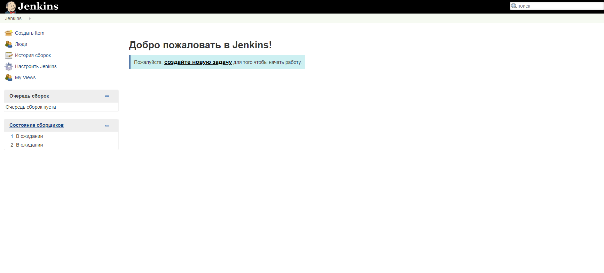

# Дипломный практикум в Yandex.Cloud
## Цели:
### Этапы выполнения:
* Создание облачной инфраструктуры
* Создание Kubernetes кластера
* Создание тестового приложения
* Подготовка cистемы мониторинга и деплой приложения
* Установка и настройка CI/CD

## Этапы выполнения:
### Создание облачной инфраструктуры
Поскольку Terraform не доступен в РФ, его не использовал.

## Создание Kubernetes кластера
* Директория - ./kube

#### Настройка мастер ноды:
    femsk@ubuntu-test-vm:~/diploma/diploma/kube$ ssh femsk@$master
    Welcome to Ubuntu 20.04.6 LTS (GNU/Linux 5.4.0-162-generic x86_64)
    femsk@master-node:~$ kubectl get nodes
    NAME          STATUS   ROLES           AGE     VERSION
    master-node   Ready    control-plane   4m57s   v1.28.1

#### Добавление воркеров в кластер:
    femsk@ubuntu-test-vm:~/diploma/diploma/kube$ ssh femsk@$master
    Welcome to Ubuntu 20.04.6 LTS (GNU/Linux 5.4.0-162-generic x86_64)
    femsk@master-node:~$ kubectl get nodes
    NAME          STATUS   ROLES           AGE   VERSION
    master-node   Ready    control-plane   11m   v1.28.1
    work-node1    Ready    <none>          26s   v1.28.1
    work-node2    Ready    <none>          26s   v1.28.1
#### Команда kubectl get pods --all-namespaces отрабатывает без ошибок:
    femsk@master-node:~$ kubectl get pods --all-namespaces
    NAMESPACE      NAME                                  READY   STATUS    RESTARTS   AGE
    kube-flannel   kube-flannel-ds-pdsfw                 1/1     Running   0          3m9s
    kube-flannel   kube-flannel-ds-svz8s                 1/1     Running   0          13m
    kube-flannel   kube-flannel-ds-ws5bm                 1/1     Running   0          3m9s
    kube-system    coredns-5dd5756b68-6s65z              1/1     Running   0          13m
    kube-system    coredns-5dd5756b68-vp2pm              1/1     Running   0          13m
    kube-system    etcd-master-node                      1/1     Running   0          13m
    kube-system    kube-apiserver-master-node            1/1     Running   0          13m
    kube-system    kube-controller-manager-master-node   1/1     Running   0          13m
    kube-system    kube-proxy-2rcrs                      1/1     Running   0          13m
    kube-system    kube-proxy-g6qz7                      1/1     Running   0          3m9s
    kube-system    kube-proxy-p4wsf                      1/1     Running   0          3m9s
    kube-system    kube-scheduler-master-node            1/1     Running   0          13m
    femsk@master-node:~$
## Создание тестового приложения и деплой приложения
* Директория ./app
* Образ nginx - docker pull femsk/nginx:1.0
* Деплой приложение в кластер:

        femsk@ubuntu-test-vm:~/diploma/diploma/app$ ansible-playbook -i ../kube/hosts deploy.yml
      
        PLAY [master] ******************************************************************************************************************************************************************************
      
        TASK [Copying yaml] ************************************************************************************************************************************************************************
        changed: [master]
      
        TASK [Deployment] **************************************************************************************************************************************************************************
        changed: [master]
      
        PLAY RECAP *********************************************************************************************************************************************************************************
        master                     : ok=2    changed=2    unreachable=0    failed=0    skipped=0    rescued=0    ignored=0
        

        femsk@master-node:~$ kubectl get pods -n diploma -owide
        NAME                  READY   STATUS    RESTARTS   AGE   IP           NODE         NOMINATED NODE   READINESS GATES
        ng-75967b7d86-p4qkj   1/1     Running   0          65m   10.244.2.2   work-node2   <none>           <none>
        ng-75967b7d86-zg58m   1/1     Running   0          65m   10.244.1.2   work-node1   <none>           <none>
        
        femsk@master-node:~$ kubectl get service -n diploma
        NAME         TYPE           CLUSTER-IP       EXTERNAL-IP     PORT(S)          AGE
        serv-nginx   LoadBalancer   10.101.133.147   158.160.98.13   8080:32387/TCP   66m
* Сервис доступен снаружи: http://158.160.98.13:32387/
  
        femsk@ubuntu-test-vm:~/diploma/diploma/app$ curl http://158.160.98.13:32387/
        <!DOCTYPE html>
        <html>
        <head>
        <title>Welcome to nginx!</title>
        
        </head>
        <body>
        <h1>HI!</h1>
        
Here is a page of a test application that emulates the main application developed by our company. .

        
      
The diploma project materials are located at:
      <a href="https://github.com/fermsk/diploma">github.com</a>. 
        
      
<em>Thanks!.</em>

      </body>
      </html>

## Подготовка cистемы мониторинга

Http доступ к web интерфейсу grafana - http://158.160.98.13:32123/ (admin admin)

## Установка и настройка CI/CD
* Директория ./cicd
  * Интерфейс ci/cd сервиса доступен по http - http://158.160.98.13:32413/

        femsk@master-node:~/kube-prometheus$ kubectl get pods --all-namespaces -owide
        NAMESPACE      NAME                                   READY   STATUS    RESTARTS   AGE     IP            NODE          NOMINATED NODE   READINESS GATES
        diploma        jenkins-7855cd94b-8gj9d                1/1     Running   0          63s     10.244.1.11   work-node1    <none>           <none>
        diploma        jenkins-7855cd94b-xf79q                1/1     Running   0          63s     10.244.2.12   work-node2    <none>           <none>
        diploma        ng-75967b7d86-p4qkj                    1/1     Running   0          4h35m   10.244.2.2    work-node2    <none>           <none>
        diploma        ng-75967b7d86-zg58m                    1/1     Running   0          4h35m   10.244.1.2    work-node1    <none>           <none>
  
        femsk@master-node:~/kube-prometheus$ kubectl get svc -n diploma
        NAME             TYPE           CLUSTER-IP       EXTERNAL-IP     PORT(S)          AGE
        serv-jenk        LoadBalancer   10.111.111.48    158.160.98.13   8081:32413/TCP   83m
        serv-jenk-jnlp   ClusterIP      10.110.213.184   <none>          50000/TCP        14m
        serv-nginx       LoadBalancer   10.101.133.147   158.160.98.13   8080:32387/TCP   4h35m

    

